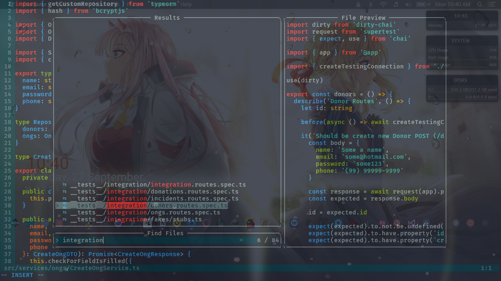

# Hállex's vim configs

## Vim setup

**Warning**: Don’t blindly use my settings unless you know what that entails. Use at your own risk!

Requires Neovim (>= 0.5)

- [vim-plug](https://github.com/junegunn/vim-plug) - A minimalist Vim plugin manager
- [nvim-lspconfig](https://github.com/neovim/nvim-lspconfig) - A collection of configurations for Neovim's built-in LSP
- [nvim-treesitter](https://github.com/nvim-treesitter/nvim-treesitter) - [Treesitter](https://github.com/tree-sitter/tree-sitter) configurations and abstraction layer for Neovim
- [completion-nvim](https://github.com/nvim-lua/completion-nvim) - An auto completion framework based on Neovim's built-in LSP
- [glepnir/lspsaga.nvim](https://github.com/glepnir/lspsaga.nvim) - A light-weight LSP plugin based on Neovim built-in LSP with highly a performant UI
- [telescope.nvim](https://github.com/nvim-telescope/telescope.nvim) - A highly extendable fuzzy finder over lists

Inspired by [Takuya's dotfiles](https://github.com/craftzdog)
